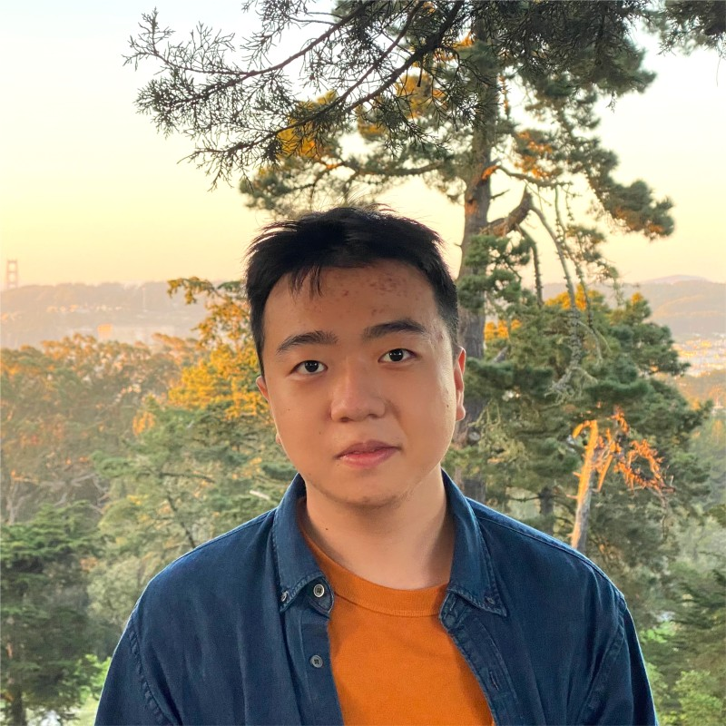

Hi there , I am currently a **Computer Science & Data Science** undergraduate student from [**New York University Shanghai**](https://shanghai.nyu.edu/). In 2022-2023, I was a studying away student at the College of Art and Science, [New York University](https://www.nyu.edu/).

**Research Interest**: Computer Vision, Robotics Pretraining, and Reinforcement Learning!

My professional and research interest lies in Artificial Intelligence and Robotics Learning, aiming to enhance robots’ perception and intelligence. My career goal is to become an AI engineer. I would like to explore more interesting areas in AI and robotics in the future!

**You can find my [CV](../assets/CV.pdf) here!**

Contact: [ky2138@nyu.edu](mailto:ky2138@nyu.edu)

<!--  -->

